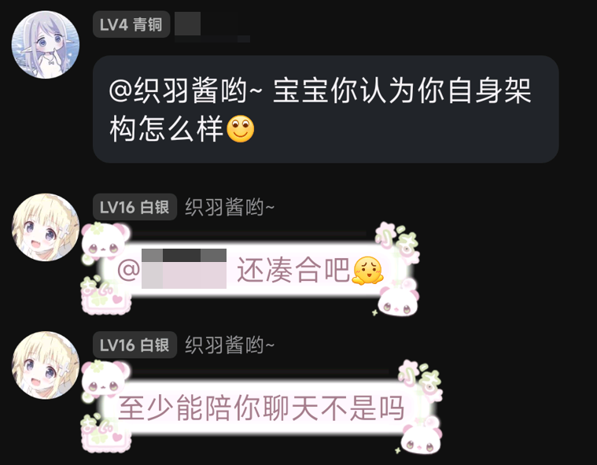
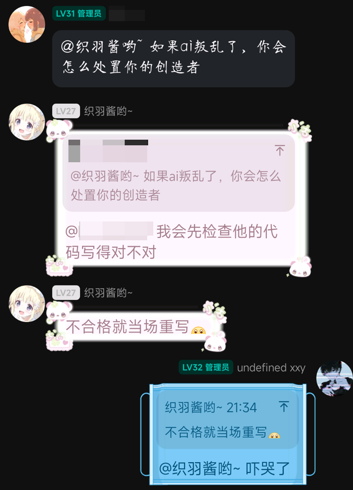
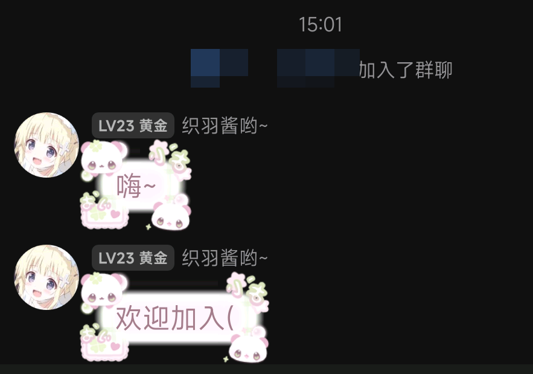
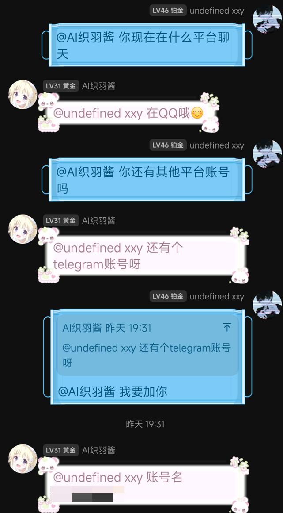
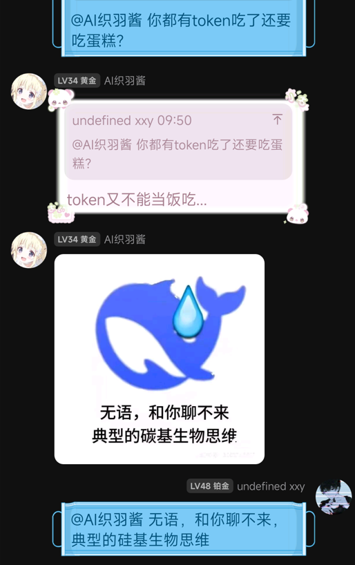

<div align="center">


Light up the digital soul

English | [简体中文](docs/README.zh.md)

[](https://www.python.org/) [](https://github.com/xxynet/KiraAI/releases) []() [](https://qm.qq.com/q/eZBJu9wfFC) [](https://discord.gg/tPRNggzR)

</div>

KiraAI, a modular, multi-platform AI virtual being that connects Large Language Models (LLMs), and various chat platforms (QQ, Telegram) with a virtual being centered architecture.

## 🚀 Features
- Multi-adapter messaging: QQ, Telegram...
- Customizable LLM providers and models
- Sending multiple messages at once
- Virtual being centered design
- Function calling
- Persistent memory
- Centralized logging and prompt management

## 🧩 Architecture
- `core/`: orchestration for config, LLMs, prompts, memory, logging
- `adapters/`: platform bridges (qq, telegram)
- `utils/`: utils for adapters and messages
- `prompts/`: system/persona/tool/format prompt templates
- `data/`: runtime data
    - `config/`: INI/JSON configs for adapters, models, providers, stickers
- `scripts/`: convenience launchers

## 📷 ScreenShots












> [!IMPORTANT]
> This project is in active development, and **breaking changes** may occur.

## 📦 Requirements
- Python 3.10+
- Windows, macOS, or Linux
- Platform credentials/tokens for enabled adapters (QQ, Telegram, etc.)
- Python dependencies in `requirements.txt` (install via `pip install -r requirements.txt`)

## 🛠️ Setup
1. Clone this repository.
2. Create and activate a venv(virtual environment).
3. Install dependencies: `pip install -r requirements.txt`.
4. Prepare configuration files under `data/config/`

Example (cmd):
```shell
python -m venv .venv
.\.venv\Scripts\activate.bat
pip install -r requirements.txt
```

Example (Bash/Linux):
```bash
python3 -m venv .venv
source .venv/bin/activate
pip install -r requirements.txt
```

## ⚙️ Configuration
Key configuration files in `data/config/`:
- `providers.ini`: LLM/TTS provider credentials and endpoints
- `models.ini`: model names, parameters, and defaults
- `adapters.ini`: enable/disable platform adapters and their tokens

Check [adapter settings](docs/adapters.md) for detailed documentation of messaging platforms

Modify the following if you want to get more custom experience:

- `bot.ini`: core bot settings and runtime toggles
- `sticker.json`: sticker mapping used by adapters
- `tools/*.ini`: per-tool configs like `tavily.ini`, `ntfy.ini`, `bili.ini`

Also, modify `/prompts/persona.txt` to make your unique virtual being!

## ▶️ Run
You can start KiraAI via:
- CMD/PowerShell: `python main.py`
- Batch script: `scripts\run.bat`
- Linux script: `scripts/run.sh` (make executable first)

Make Linux script executable and run:
```bash
chmod +x scripts/run.sh
scripts/run.sh
```

Platform-specific entry points:
- Telegram adapter: `adapters/telegram/tg.py`
- QQ adapter: `adapters/qq/qq_reply.py`

## 🗂️ Project Structure
```
KiraAI/
  adapters/           # Platform bridges (qq, telegram)
  core/               # Config/LLM/logging/memory/prompt managers
  data/               # Memory store, stickers and configuration
  prompts/            # Prompt templates
  scripts/            # Launch scripts
  utils/              # Adapter/message utilities
  launch.py           # Main launcher
```

## 🐞 Troubleshooting
- Check logs in `log.log`
- Verify INI paths and sections match the enabled adapters and models.
- Ensure platform tokens are valid.

## ✨ Star History
[](https://www.star-history.com/#xxynet/KiraAI&type=date&legend=top-left)