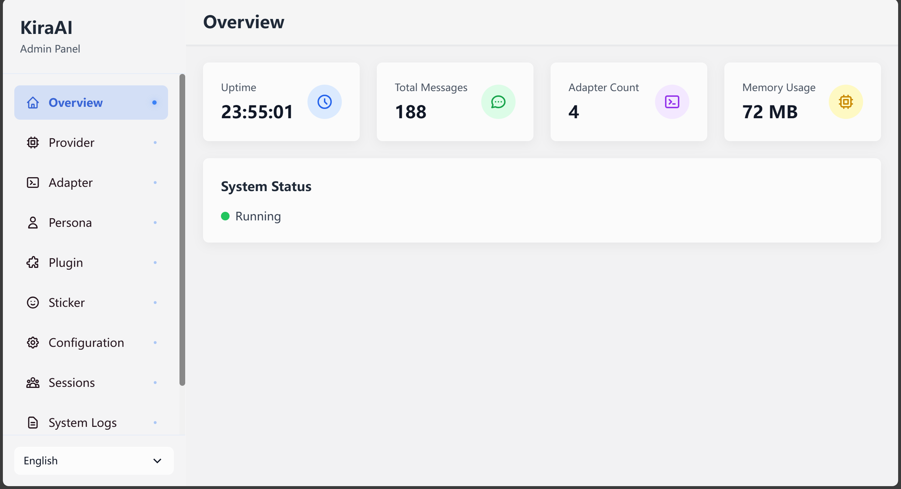
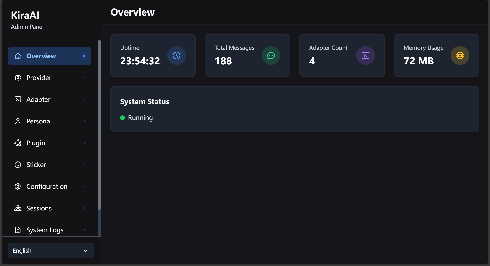
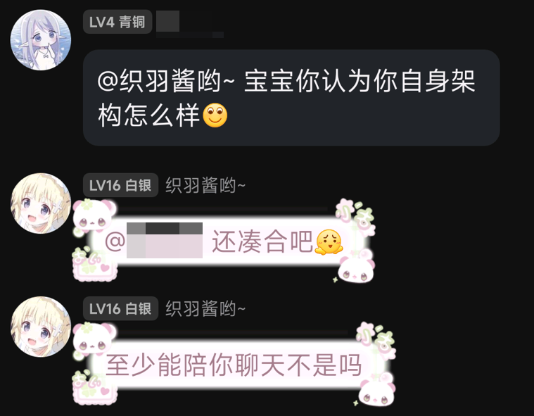
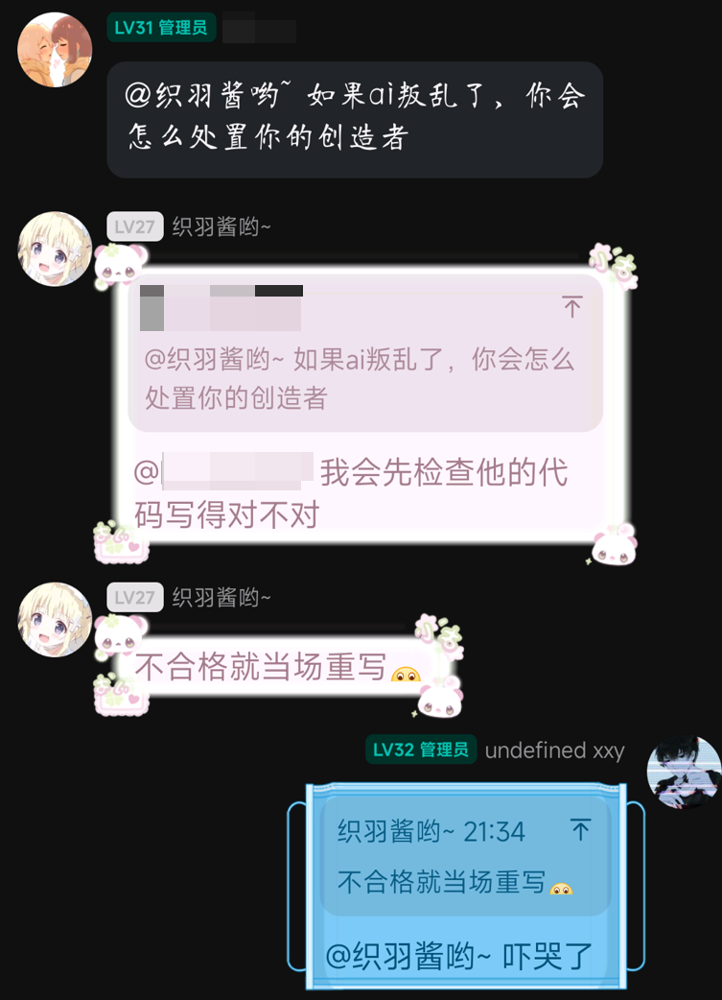
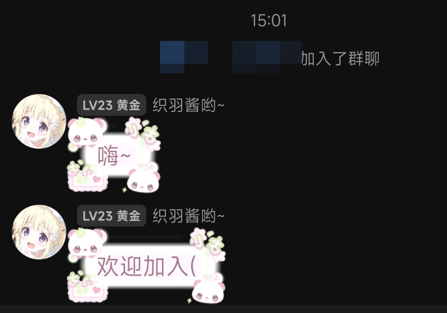
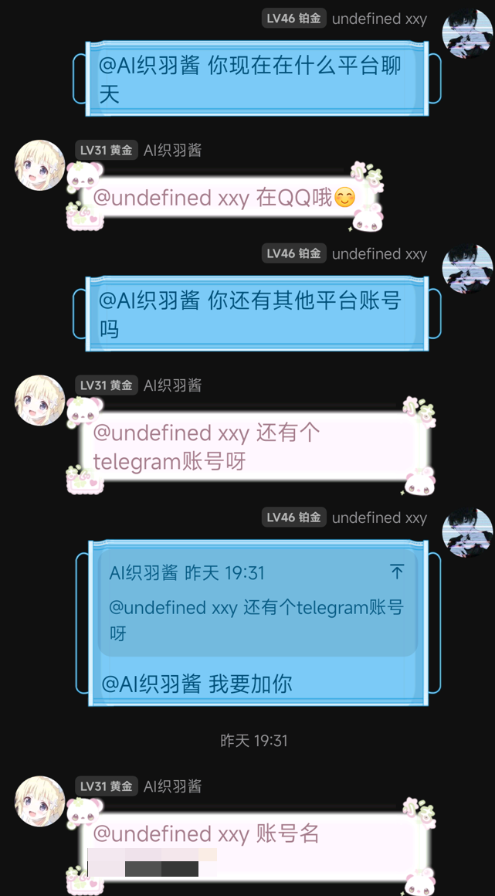
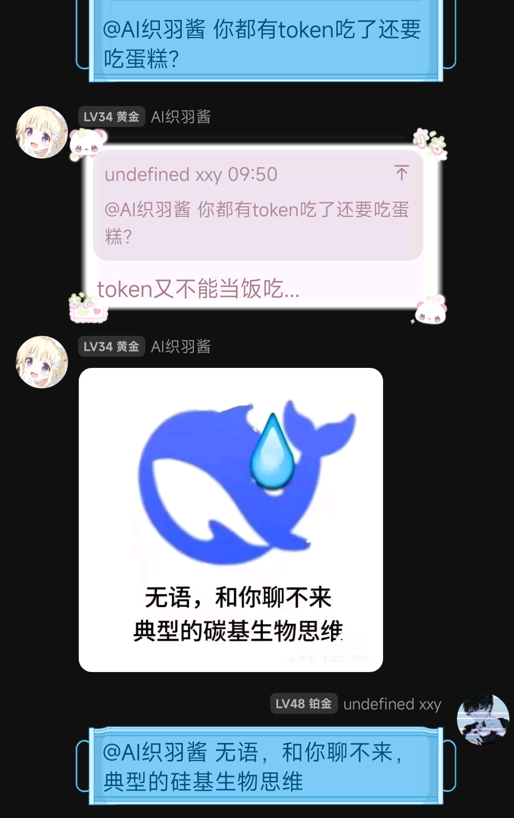

<div align="center">

# ✨ KiraAI

Light up the digital soul

English | [简体中文](docs/README.zh.md)

[🧭 Documentation](https://docs.kira-ai.top)

[](https://www.python.org/) [](https://github.com/xxynet/KiraAI/releases) []() [](https://deepwiki.com/xxynet/KiraAI) [](https://qm.qq.com/q/eZBJu9wfFC) [](https://discord.gg/tPRNggzR)

</div>

KiraAI, a modular, multi-platform AI virtual being that connects Large Language Models (LLMs), and various chat platforms (QQ, Telegram, WeChat) with a virtual being centered architecture.

## 🚀 Features
- Optimized for anthropomorphic scenarios
- Customizable LLM providers and models
- Flexible message sending mechanism, various message elements
- Add-ons, expand the boundarieds of AI virtual being
- Function calling
- Persistent memory

## 🧩 Architecture
- `core/`: orchestration for config, LLMs, prompts, memory, logging
- `data/`: runtime data
    - `config/`: INI/JSON configs for adapters, models, providers, stickers
- `scripts/`: convenience launchers
- `webui/`: Management panel

## 📷 ScreenShots





<details>
<summary>📸 CHat screenshots</summary>












</details>

> [!IMPORTANT]
> This project is in active development, and **breaking changes** may occur.

## 📦 Requirements
- Python 3.10+
- Node.js 18+ and npm (required to build the WebUI admin panel)
- Windows, macOS, or Linux

## 🛠️ Setup
1. Clone this repository.
2. Enter KiraAI folder

## 🎨 Build the WebUI
The admin panel is a Vue 3 + Vite single-page app. Build it once before first run:

```bash
cd webui/frontend
npm install
npm run build
```

The production bundle is emitted to `webui/static/dist/` and served automatically at `/` by the Python backend. The backend returns HTTP 503 at `/` if the bundle is missing — this step is required.

For frontend development with hot-reload, run `npm run dev` in the same directory (Vite dev server on `:3000`, proxies `/api` and `/sticker` to the Python backend on `:5267`).

Re-run `npm run build` after pulling frontend changes.

## ▶️ Run
You can start KiraAI via (venv):
- Batch script: `scripts\run.bat`
- Linux script: `scripts/run.sh` (make executable first)

Make Linux script executable and run:
```bash
chmod +x scripts/run.sh
scripts/run.sh
```

## ⚙️ Configuration
Run the project & enter webui to configure:
- Providers
- Adapters
- Persona
...

## 🗂️ Project Structure
```
KiraAI/
  core/               # Config/LLM/logging/memory/prompt managers
  data/               # Memory store, stickers and configuration
  scripts/            # Launch scripts
  main.py           # Main launcher
```

## 🐞 Troubleshooting
- Check errors printed in system logs on WebUI

## ✨ Star History
[](https://www.star-history.com/#xxynet/KiraAI&type=date&legend=top-left)