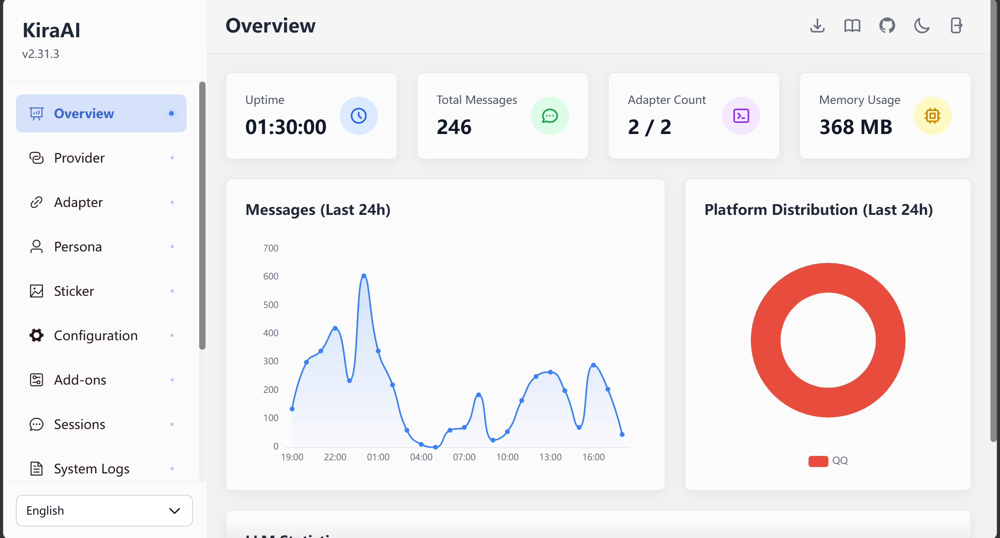
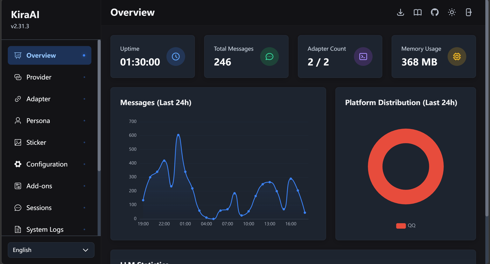
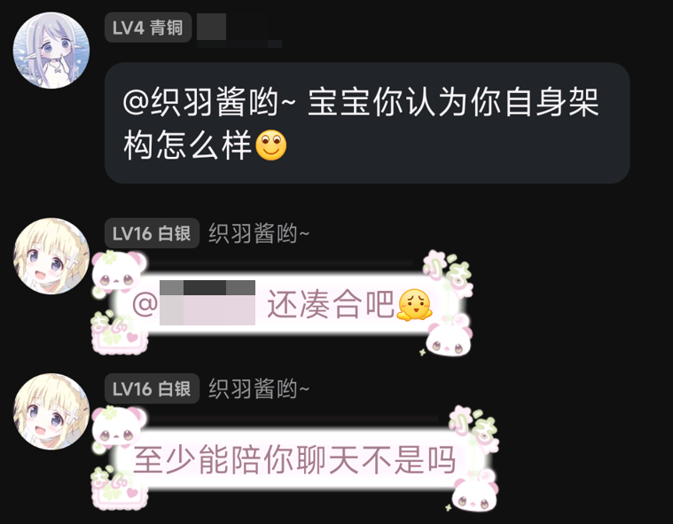
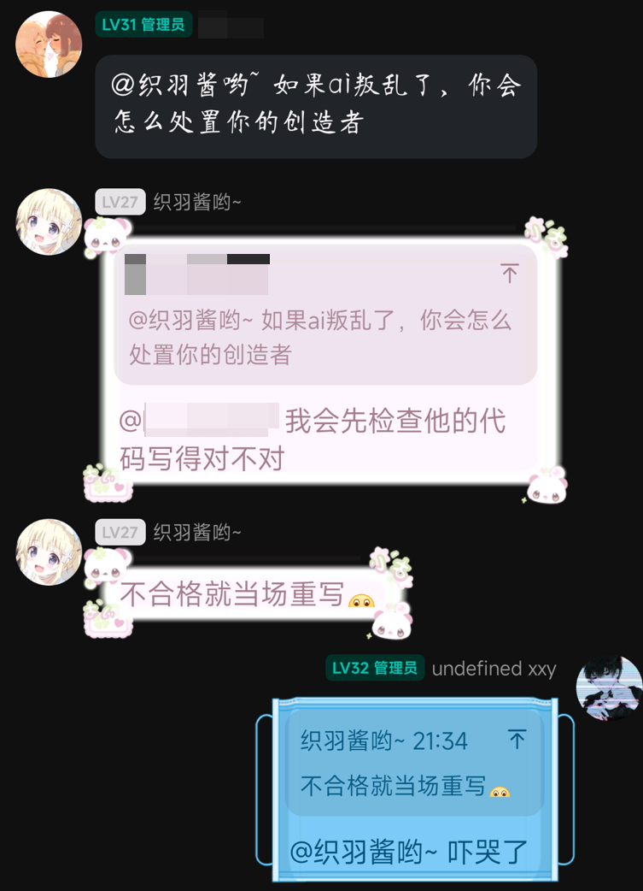
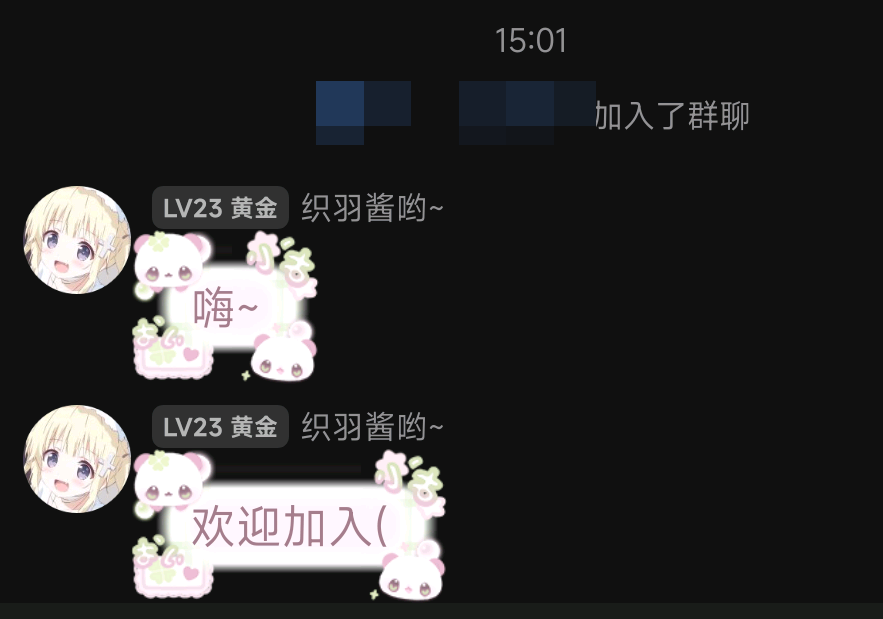
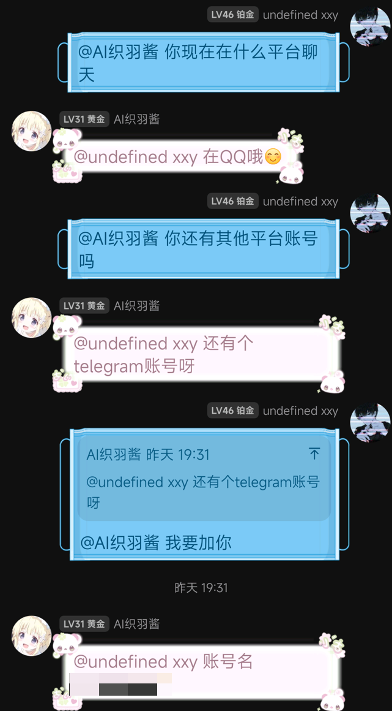
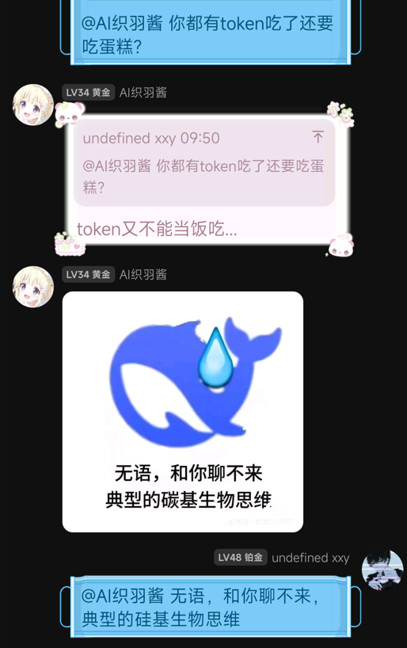

<div align="center">

# ✨ KiraAI

Light up the digital soul

English | [简体中文](docs/README.zh.md)

[🧭 Documentation](https://docs.kira-ai.top)

[](https://www.python.org/) [](https://github.com/xxynet/KiraAI/releases) [](https://github.com/xxynet/KiraAI/commits) [](https://deepwiki.com/xxynet/KiraAI) [](https://qm.qq.com/q/eZBJu9wfFC) [](https://discord.gg/mRNmVmFHn3)

</div>

KiraAI, a modular, multi-platform AI digital life that connects various AI models (LLM, TTS, STT, image/video generation, etc.) and chat platforms (QQ, Telegram, WeChat, Discord, Bilibili, etc.) with a digital life centered architecture.

## 🚀 Features
- Optimized for anthropomorphic scenarios
- Easy-to-use WebUI
- Customizable LLM providers and models
- Flexible message sending mechanism, various message elements
- Plugins, expand the boundaries of AI digital life

## 📷 ScreenShots





<details>
<summary>📸 CHat screenshots</summary>












</details>

> [!IMPORTANT]
> This project is in active development, and **breaking changes** may occur.

## 💻 Quick Start

> [!NOTE]
> For other deployment options, see the [Deployment Guide](https://docs.kira-ai.top/deployment/windows.html).

First of all, you need to have Python 3.10+ installed and in the `PATH` environment variable

Go to [Releases](https://github.com/xxynet/KiraAI/releases) and download `Source code
(zip)` from the release tagged latest

Extract zip and run `scripts/run.bat` on Windows or run `scripts/run.sh` on Linux or Mac

### 🐳 Docker (alternative)

Prefer containers? Make sure [Docker](https://docs.docker.com/get-docker/) is installed, then:

```bash
# Pull the prebuilt image and start in the background
docker compose up -d
```

KiraAI will be served at `http://localhost:5267`. Runtime data is persisted under `./data` (mounted to `/app/data` inside the container).

```bash
docker compose logs -f    # follow logs
docker compose down       # stop the container
```

> `docker-compose.yml` pulls `xxynet/kira-ai:latest` from Docker Hub by default and contains no `build` section.

## 🧪 Development Guide

<details>
<summary>Toggle Development Guide</summary>

## 📦 Requirements
- Python 3.10+
- Node.js 18+ and npm (required to build the WebUI admin panel)
- Windows, macOS, or Linux

## 🛠️ Setup
1. Clone this repository.
2. Enter KiraAI folder

## 🎨 Build the WebUI
The admin panel is a Vue 3 + Vite single-page app. Build it once before first run:

```bash
cd webui/frontend
npm install
npm run build
```

The Vite build emits to `webui/static/dist/`. At startup, the backend checks for the matching frontend dist in `data/dist/` — if missing or outdated, it automatically downloads the pre-built bundle from GitHub Releases. The backend returns HTTP 503 at `/` if no dist is available.

For frontend development with hot-reload, run `npm run dev` in the same directory (Vite dev server on `:3000`, proxies `/api` and `/sticker` to the Python backend on `:5267`).

To use your local build instead of the downloaded one, pass `--webui-dir` and optionally skip the version check:

```bash
python main.py --webui-dir webui/static/dist --ignore-webui-version-check
```

Re-run `npm run build` after pulling frontend changes.

## ▶️ Run
You can start KiraAI via (venv):
- Batch script: `scripts\run.bat`
- Linux script: `scripts/run.sh` (make executable first)

Make Linux script executable and run:
```bash
chmod +x scripts/run.sh
scripts/run.sh
```

</details>

## ⚙️ Configuration
Run the project & enter webui to configure:
- Providers
- Adapters
- Persona
...

## 🛠️ CLI Parameters

KiraAI can be launched from the command line. All parameters are optional; sensible defaults are used when omitted.

| Parameter | Description | Default | Example |
| --- | --- | --- | --- |
| `--data-dir <path>` | Directory where KiraAI stores runtime data (databases, logs, cache, session files). | `./data` | `kiraai --data-dir /var/lib/kiraai` |
| `--env <dev\|prod>` | Runtime environment. `dev` enables debug logging, hot reload, and verbose errors; `prod` enables optimized behavior and production-grade logging. Can also be set via the `KIRA_ENV` environment variable. | `prod` | `kiraai --env dev` |
| `--disable-webui-auth` | Disables authentication for the WebUI. Only recommended on trusted local networks. | Off (auth enabled) | `kiraai --disable-webui-auth` |
| `--telemetry-server <url>` | Overrides the endpoint that telemetry data is reported to. Can also be set via the `KIRA_TELEMETRY_SERVER` environment variable. | Default KiraAI telemetry endpoint | `kiraai --telemetry-server https://telemetry.example.com` |
| `--webui-dir <path>` | Path to a custom WebUI static directory (frontend build) to serve instead of the bundled one. | Bundled WebUI | `kiraai --webui-dir ./webui/dist` |
| `--ignore-webui-version-check` | Skips the WebUI ↔ backend version compatibility check. Useful when running a custom-built or mismatched WebUI version. | Off (version check enabled) | `kiraai --ignore-webui-version-check` |

### Environment variables

| Variable | Description |
| --- | --- |
| `KIRA_ENV` | Equivalent to `--env`. Accepted values: `dev`, `prod`. |
| `KIRA_TELEMETRY_SERVER` | Equivalent to `--telemetry-server`. |

## 📡 Telemetry

KiraAI collects anonymous telemetry data to understand how the project is used, prioritize development efforts, and improve stability. Telemetry is **enabled by default**.

### What is collected

- **Anonymous usage data** — aggregate statistics: message counts per platform, LLM call counts and token usage, average response time.
- **Runtime environment** — KiraAI version, Python version, OS platform.
- **Client identifier** — a randomly generated, anonymous installation ID.
- **Country code** — resolved once at startup via a third-party service (`ip-api.com`, plain HTTP) based on your public IP address.

No chat content, message history, personal information, or file/configuration contents are collected or transmitted.

### Disabling telemetry

Telemetry is on by default. Disable it in either of the following ways:

**Via environment variable** (recommended):

```bash
KIRA_TELEMETRY_ENABLED=0 python main.py
```

**Via `system_config.json`** — set `telemetry.enabled` to `false` and restart KiraAI:

```json
{
  "telemetry": {
    "enabled": false
  }
}
```

> Note: there is currently no WebUI switch for telemetry.

## 🗂️ Project Structure

<details>
<summary>Toggle Project Structure</summary>

```
KiraAI/
  core/               # Core modules
    event_bus.py        # EventBus: async pub/sub bus for internal & platform events
    launcher.py         # KiraLauncher: boots the WebUI & lifecycle
    lifecycle.py        # KiraLifecycle: central manager of all modules & background tasks
    llm_client.py       # LLMClient: unified LLM client with tool-calling support
    logging_manager.py  # Colored console logging + rotating file handler
    temp_monitor.py     # AsyncTempMonitor: async cleanup of temp/cache folders
    adapter/           # Chat platform adapters
    agent/             # Agent executor, MCP & skill management
    chat/              # Session management & message handling
    config/            # Configuration loading & field definitions
    db/                # Database management & models
    persona/           # Persona management
    plugin/            # Plugin system
    prompts/           # Prompt templates
    provider/          # LLM provider management
    statistics/        # Statistics module
    tag/               # Tag system
    telemetry/         # Telemetry module
    utils/             # Common utilities
    workflow/          # Workflow system
  data/               # Memory, stickers, configs, plugin data
  docs/               # Documentation
  scripts/            # Launch scripts
  screenshots/        # Screenshots
  webui/              # WebUI backend & frontend
  main.py             # Main launcher
```

</details>

## ✨ Star History
[](https://www.star-history.com/#xxynet/KiraAI&type=date&legend=top-left)