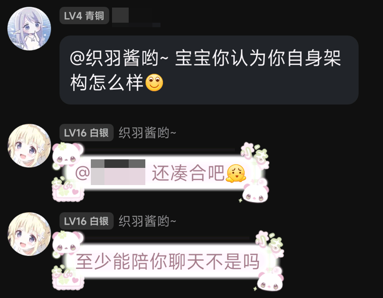
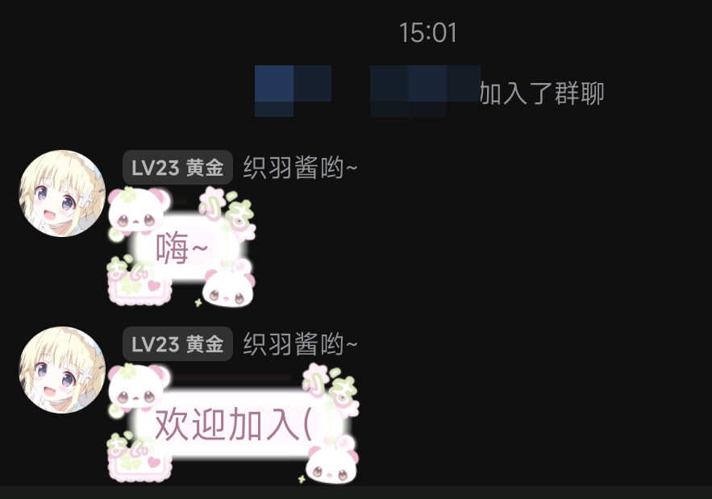
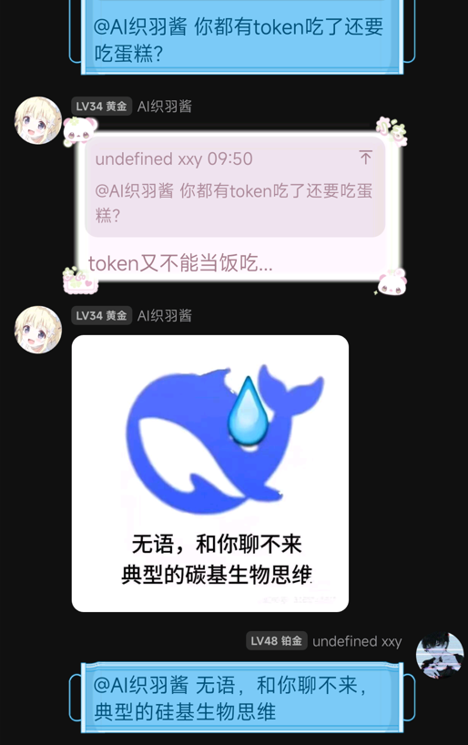

<div align="center">

# ✨ KiraAI

点亮数字生命灵魂

[English](../README.md) | 简体中文

</div>

KiraAI 是一个模块化、跨平台的 AI 数字生命项目，以数字生命为中心，连接大语言模型（LLM）与多种聊天平台（QQ、Telegram 等）。

## 🚀 功能特性
- 多适配器消息：QQ、Telegram...
- 可自定义的 LLM 提供商与模型
- 支持单次发送多条消息
- 以数字生命为中心的设计
- Function Calling（函数调用）
- 持久化记忆
- 集中式日志与提示词管理

## 🧩 架构说明
- `core/`：配置、LLM、提示词、记忆、日志的编排中心
- `adapters/`：平台适配层（qq、telegram）
- `utils/`：适配器与消息相关工具
- `prompts/`：系统/人设/工具/格式等提示词模板
- `config/`：适配器、模型、提供商、贴纸等 INI/JSON 配置
- `data/`：运行期数据
- `scripts/`：便捷启动脚本

## 📷 截图










> [!IMPORTANT]
> 本项目在活跃开发期间，可能会有 **破坏性更新**

## 📦 环境要求
- Python 3.10+
- Windows、macOS 或 Linux
- 各平台适配器所需的凭证/Token（QQ、Telegram 等）
- `requirements.txt` 中的 Python 依赖（使用 `pip install -r requirements.txt` 安装）

## 🛠️ 安装与初始化
1. 克隆本仓库。
2. 创建并激活虚拟环境（venv）。
3. 安装依赖：`pip install -r requirements.txt`。
4. 在 `config/` 目录下准备配置文件。

示例（cmd）：
```shell
python -m venv .venv
.\.venv\Scripts\activate.bat
pip install -r requirements.txt
```

示例（Bash/Linux）：
```bash
python3 -m venv .venv
source .venv/bin/activate
pip install -r requirements.txt
```

## ⚙️ 配置项
`config/` 目录中的关键配置：
- `providers.ini`：LLM/TTS 提供商的凭证与端点
- `models.ini`：模型名称、参数与默认值
- `adapters.ini`：启用/禁用平台适配器及其 Token

本项目使用 [napcat](https://napneko.github.io/) 与QQ客户端交互，如果需要部署到QQ请先配置 napcat

如需更个性化体验，可调整：

- `bot.ini`：核心 Bot 设置与运行时开关
- `sticker.json`：适配器使用的贴纸映射
- `tools/*.ini`：工具级配置，例如 `tavily.ini`、`ntfy.ini`、`bili.ini`

另外, 修改 `/prompts/persona.txt` 来创建你的数字生命人格

## ▶️ 运行
可通过以下方式启动 KiraAI：
- CMD/PowerShell：`python launch.py`
- Windows 批处理：`scripts\run.bat`
- Linux 脚本：`scripts/run.sh`（先赋予可执行权限）

Linux 赋权并运行：
```bash
chmod +x scripts/run.sh
scripts/run.sh
```

平台入口示例：
- Telegram 适配器：`adapters/telegram/tg.py`
- QQ 适配器：`adapters/qq/qq_reply.py`

## 🗂️ 项目结构
```
KiraAI/
  adapters/           # 平台适配层（qq、telegram）
  config/             # 适配器/模型/提供商/工具的 INI/JSON 配置
  core/               # 配置/LLM/日志/记忆/提示词 管理器
  data/               # 记忆存储与素材（贴纸）
  prompts/            # 提示词模板
  scripts/            # 启动脚本
  src/tools/          # 工具管理与检索
  utils/              # 适配器/消息工具
  launch.py           # 主启动入口
```

## 🐞 故障排查
- 查看各适配器的日志目录（例如 `adapters/qq/logs/`）。
- 校验 INI 路径与节名是否与启用的适配器、模型一致。
- 检查平台 Token 是否有效且未被限流。

## ✨ Star History
[](https://www.star-history.com/#xxynet/KiraAI&type=date&legend=top-left)

